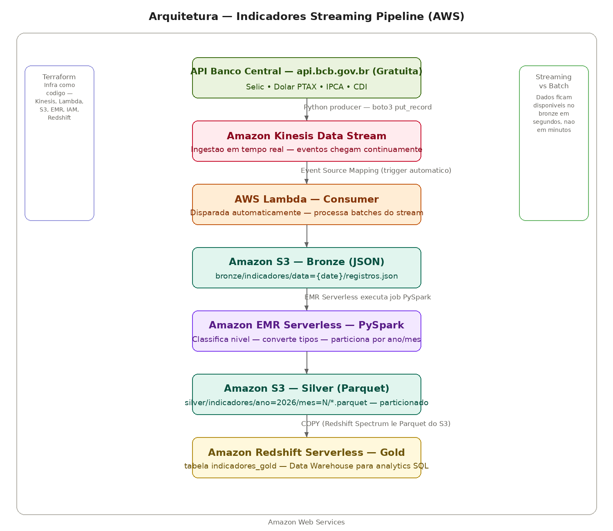

# Indicadores Streaming Pipeline — AWS

Pipeline de dados em **streaming** que captura indicadores econômicos do Banco Central em tempo real, processa com Spark distribuído e disponibiliza para análise em um Data Warehouse — usando arquitetura serverless de ponta a ponta na AWS.

## Arquitetura



**Ingestão (streaming):** Um producer em Python publica cada registro de indicador econômico — Selic, Dólar PTAX, IPCA e CDI — como um evento individual no **Amazon Kinesis Data Stream**, simulando dados chegando em tempo real.

**Consumo automático:** O Kinesis tem um **Event Source Mapping** configurado com uma **AWS Lambda** — toda vez que novos registros chegam no stream, a Lambda é disparada automaticamente, sem polling manual. Ela decodifica os registros e salva no S3 (camada bronze) em JSON, particionado por data.

**Bronze (S3):** Dados brutos preservados exatamente como chegaram — formato JSON, particionado por data de extração.

**Transformação (EMR Serverless + PySpark):** Um job Spark roda no **Amazon EMR Serverless** — sem cluster gerenciado — lendo o bronze, aplicando classificações de nível por indicador, convertendo tipos e particionando por ano/mês. Salva em **Parquet** na camada silver.

**Silver (S3):** Dados limpos e tipados em formato colunar Parquet, particionados por ano/mês para leitura eficiente.

**Gold (Redshift Serverless):** Os dados do silver são carregados via `COPY` direto do S3 para o **Amazon Redshift Serverless**, ficando disponíveis para consultas SQL analíticas.

**Infraestrutura como código:** Todo o ambiente — Kinesis, Lambda, IAM Roles, S3, Glue Catalog, EMR Serverless e Redshift Serverless — provisionado via **Terraform**.

## Por que streaming em vez de batch?

Numa arquitetura batch tradicional, os dados são processados em janelas — por exemplo, uma vez por hora ou por dia. Numa arquitetura de streaming, cada evento é processado individualmente conforme chega.

Com Kinesis + Lambda, os dados ficam disponíveis no Data Lake em **segundos** após serem gerados — fundamental para casos de uso como detecção de fraude, monitoramento de transações financeiras e dashboards em tempo real.

## Indicadores monitorados

| Indicador | Código BCB | Frequência |
|---|---|---|
| Selic | 11 | Diária |
| Dólar PTAX | 1 | Diária |
| IPCA | 433 | Mensal |
| CDI | 12 | Diária |

## Tecnologias AWS

| Serviço | Função | Equivalente Azure | Equivalente GCP |
|---|---|---|---|
| **Amazon Kinesis** | Streaming de eventos em tempo real | Event Hubs | Pub/Sub |
| **AWS Lambda** | Processamento serverless event-driven | Azure Functions | Cloud Functions |
| **Amazon S3** | Data Lake (bronze e silver) | Blob Storage | Cloud Storage |
| **Amazon EMR Serverless** | Spark distribuído gerenciado | Databricks | Dataproc |
| **AWS Glue Catalog** | Catalogação de schema | Data Factory | Data Catalog |
| **Amazon Redshift Serverless** | Data Warehouse (gold) | Synapse Analytics | BigQuery |
| **Terraform** | Infraestrutura como código | Terraform | Terraform |

## Medallion Architecture

**Bronze (S3, JSON):** Dado bruto exatamente como recebido do Kinesis via Lambda — particionado por data de extração.

**Silver (S3, Parquet):** Dado tipado, classificado por nível (alta/moderada/baixa) e particionado por ano/mês — formato colunar otimizado para leitura analítica.

**Gold (Redshift Serverless):** Tabela `indicadores_gold` carregada via COPY direto do S3, pronta para consultas SQL.

## Transformações PySpark — camada silver

- **valor_double** — conversão do valor (string) para double
- **classificacao** — nível do indicador por série:
  - Selic/CDI: alta (≥12% a.a.), moderada (≥8%), baixa (<8%)
  - IPCA: alta (≥0.5% a.m.), moderada (≥0.2%), baixa (<0.2%)
  - Dólar: alto (≥6), moderado (≥5), baixo (<5)
- **valor_arredondado** — valor com 4 casas decimais
- **ano / mes** — extraídos da data para particionamento

## Queries no Redshift Serverless

```sql
-- Media e classificacao por indicador
SELECT indicador, classificacao, COUNT(*) as total, AVG(valor_arredondado) as media
FROM indicadores_gold
GROUP BY indicador, classificacao
ORDER BY indicador;

-- Historico do dolar nos meses de alta
SELECT data, valor_arredondado
FROM indicadores_gold
WHERE indicador = 'Dolar PTAX' AND classificacao = 'alto'
ORDER BY data DESC;
```

## Por que cada serviço foi escolhido

**Kinesis vs Kafka:** Mesma arquitetura de streaming orientada a eventos — producers publicam em "shards" (equivalente a partitions do Kafka), consumers leem de forma independente. Kinesis é a versão totalmente gerenciada da AWS.

**EMR Serverless vs cluster EMR tradicional:** Não precisei provisionar nem dimensionar cluster — só submeto o job e a AWS aloca os recursos (CPU/memória) automaticamente, cobrando apenas pelo tempo de execução.

**Redshift Serverless vs Athena:** Para cargas de trabalho com queries recorrentes de BI/analytics, o Redshift oferece melhor performance com dados já carregados na tabela (em vez de escanear arquivos no S3 a cada query como o Athena).

## Como rodar

### 1. Criar infraestrutura AWS
```bash
aws configure
cd infra
terraform init
terraform apply
```

### 2. Enviar dados para o Kinesis (producer)
```bash
python3 producer/producer.py
```

### 3. Rodar transformação no EMR Serverless
```bash
aws emr-serverless start-job-run \
  --application-id <app-id> \
  --execution-role-arn <role-arn> \
  --job-driver '{"sparkSubmit": {"entryPoint": "s3://bucket/scripts/transform.py", ...}}'
```

### 4. Carregar no Redshift
```bash
aws redshift-data execute-statement \
  --workgroup-name indicadores-wg \
  --database indicadoresdb \
  --sql "COPY indicadores_gold FROM 's3://bucket/silver/indicadores/' IAM_ROLE default FORMAT AS PARQUET;"
```

## Autor

**Lucas Magalhães** — Engenheiro de Dados

[](https://github.com/lucasmagalhaess)
[](https://linkedin.com/in/lucasmagalhaes-data)
